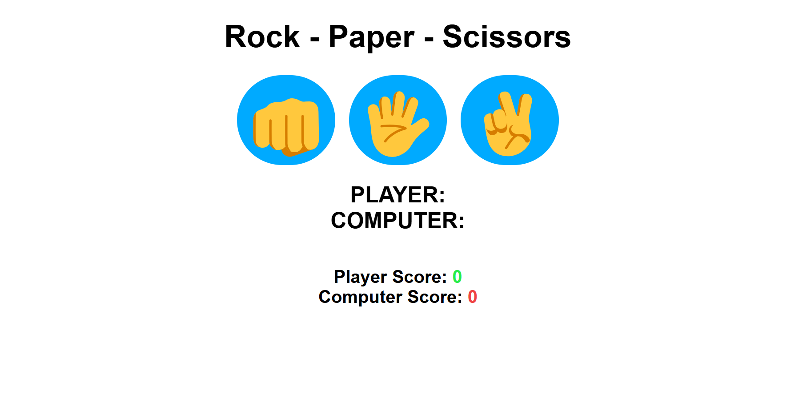
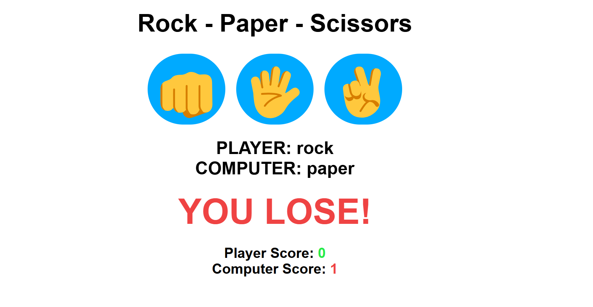

)# Rock Paper Scissors Game 🎮

A fun and interactive **Rock Paper Scissors** game built using **HTML**, **CSS**, and **JavaScript**. This project demonstrates core web development concepts and provides a simple yet engaging user experience.

## Features ✨
- **User vs Computer Gameplay**: Play against a computer with random choices.
- **Round-based Gameplay**: Play 5 rounds, and the winner is determined based on the majority of wins.
- **Dynamic Score Tracking**: Real-time score updates for both the player and the computer.
- **Interactive UI**: Visual feedback with colors for win, lose, or tie outcomes.

## How to Play 🚀
1. Choose your move: **Rock**, **Paper**, or **Scissors**.
2. The computer will randomly pick its move.
3. The result of each round (win, lose, or tie) will be displayed.

## Technologies Used 🛠️
- **HTML**: Structure and layout of the game.
- **CSS**: Styling and responsiveness for an attractive UI.
- **JavaScript**: Game logic and interactivity.

## Live Demo 🔗
[Play the Game Now](#) *(Replace `#` with your live demo link, e.g., GitHub Pages URL)*

## Screenshots 📸


## How to Run Locally 🖥️
1. Clone this repository:
   ```bash
   git clone https://github.com/your-username/rock-paper-scissors.git
